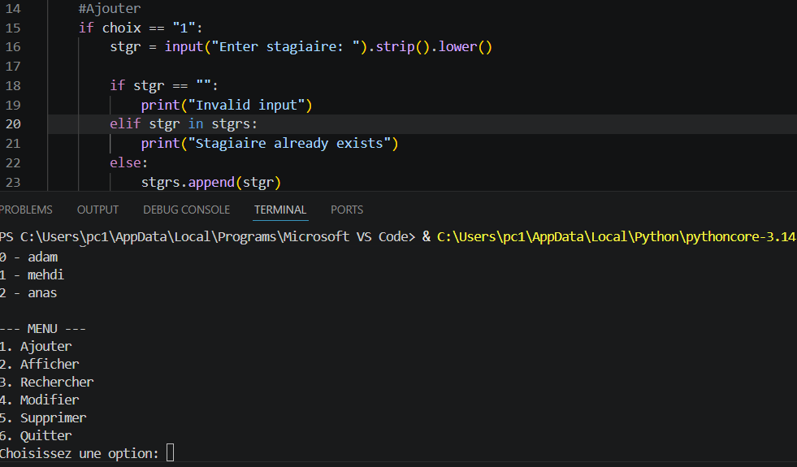

# Stagiaire Manager (CLI - Python)

This is one of my first Python projects.

Instead of only doing exercises, I wanted to build something simple that actually works.

So I created a small command-line application to manage stagiaires.

## Features
- Add a stagiaire
- Display all stagiaires
- Search for a stagiaire
- Modify or delete a stagiaire

## My experience
At first, organizing the menu and logic was a bit challenging, but after trying multiple times, I managed to make it work.

This project helped me understand how to think step by step when building a program.

## Next step
- Add file saving
- Improve code structure using functions
## Demo

